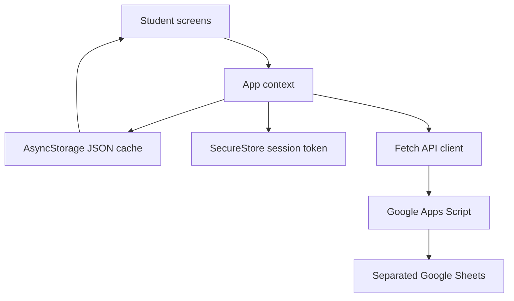

# Architecture

## Offline-first data flow

The app reads its persisted state before showing navigation. Browsing and completed downloads never wait for the network. A content download is committed to the local cache only after its complete payload is valid. Failed progress synchronization leaves attempts marked as pending; the next connected network event retries them.

## Boundaries

| Boundary | Responsibility |
| --- | --- |
| Screens | Rendering, input validation, and navigation only |
| App context | State transitions, guest rules, downloads, attempts, and synchronization |
| API service | Timeout, request envelope, secure token lookup, and backend actions |
| Storage service | Versioned JSON persistence, defaults, and byte estimates |
| Apps Script | Authentication, authorization, data mapping, version data, and attempt writes |
| Sheets | Content and account records separated by concern |

## Future-safe decisions

- `isPremium` exists as a data flag but does not affect V1 behavior.
- Unit and paper versions support update prompts without sub-units.
- The mobile client depends on an action-based JSON contract, not sheet column positions.
- Attempts keep question snapshots so answer review still works after a download is deleted or updated.
- Screen components do not import Sheets logic, allowing the backend to be replaced later.

No V1 code implements subscriptions, payments, analytics, gamification, AI, notes, flashcards, or social learning.
